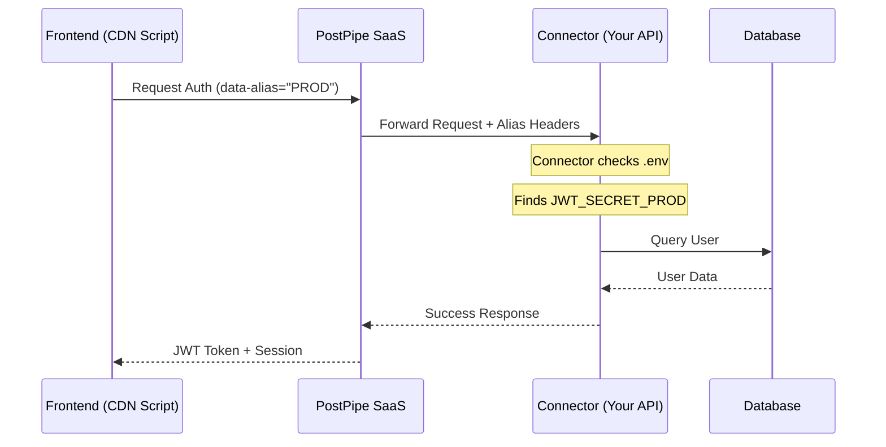

# 🔐 Auth Presets & Aliases

PostPipe's authentication system is designed for flexibility. Whether you're running a single app or managing a fleet of microsites, **Auth Presets** and **Aliases** ensure your configuration is secure, organized, and scalable.

## 🏗️ What is an Auth Preset?

An **Auth Preset** is a pre-configured set of authentication rules and providers. Instead of configuring auth from scratch for every project, you create a preset in the Dashboard and apply it wherever needed.

**A Preset contains:**
-   **Providers**: (Email, Google, GitHub, etc.)
-   **Redirection URLs**: Where users go after login/logout.
-   **Security Settings**: Token expiry, password complexity, etc.
-   **Database Target**: Which database this preset should use.

## 📊 Visual Flow: Alias Mapping



---

## 🕵️ The Alias System

The **Alias System** is the secret sauce that allows PostPipe to scale. It maps your dashboard configurations to your server's environment variables using a unique suffix.

### Why use an Alias?
Imagine you have two projects: `Store` and `Blog`. Both need a `JWT_SECRET`.
-   **Without Aliases**: You'd have a collision in your global `.env`.
-   **With Aliases**: You define an alias `STORE` for one and `BLOG` for the other.

PostPipe will then look for:
-   `JWT_SECRET_STORE`
-   `JWT_SECRET_BLOG`

---

## 🚀 Setting Up Your First Preset

1.  **Navigate to Dashboard**: Go to the **Auth Preset Generator**.
2.  **Configure Basics**: Give your preset a name (e.g., "Main Production").
3.  **Set the Alias**: In Advanced Settings, enter an Uppercase identifier (e.g., `PROD`).
4.  **Save & Generate**: PostPipe will provide you with a `projectId` and a list of required environment variables.

### Environment Variable Mapping
When using an alias like `PROD`, you must suffix your variables in your connector's `.env` file:

```env
# Global (no suffix)
DATABASE_URL=mongodb://...

# Aliased (with _PROD suffix)
FRONTEND_URL_PROD=https://myapp.com
JWT_SECRET_PROD=your_unique_secret
SMTP_PASSWORD_PROD=your_smtp_key
```

---

## 🛠️ Implementation in Your Frontend

Once your preset and alias are configured, update your CDN script tag to include the `data-alias` and `data-project-alias` attributes.

```html
<script 
  src="https://postpipe.in/api/public/cdn/auth.js" 
  data-project-id="your-project-id"
  data-alias="PROD"
  data-project-alias="MY_AWESOME_PROJECT"
></script>
```

### Script Parameter Breakdown:
-   **data-project-id**: The unique ID of your preset.
-   **data-alias**: Tells the backend which `_SUFFIX` to use for environment variables.
-   **data-project-alias**: Used for branding and project-wide identification.

---

## 💡 Best Practices

> [!TIP]
> **Keep Aliases Short & Uppercase**: Use 3-5 character abbreviations for clarity (e.g., `DEV`, `STG`, `PROD`).

> [!IMPORTANT]
> **Security First**: Never hardcode your secrets. Always use the aliased environment variables on your server/connector.

> [!NOTE]
> **Consistent Branding**: Use the `projectAlias` to ensure that automated emails (like password resets) use the correct brand name.

---

[Back to Introduction](/docs/introduction)
| [View All Guides](/docs/guides)
