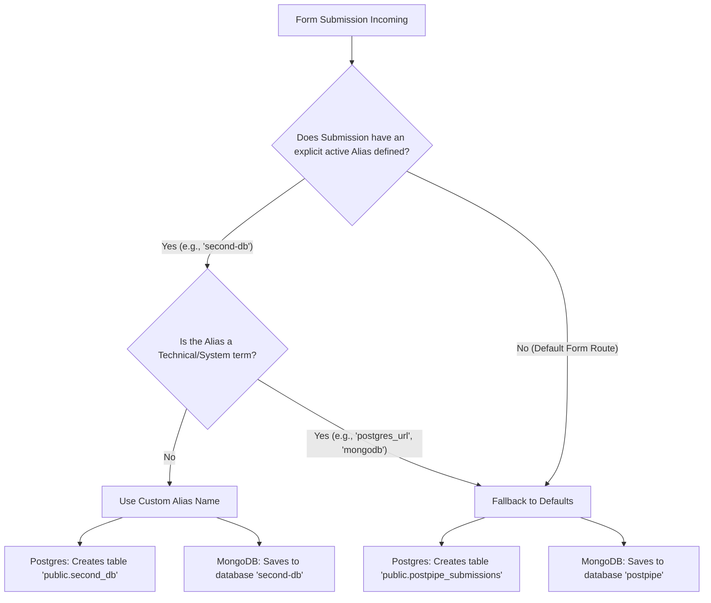
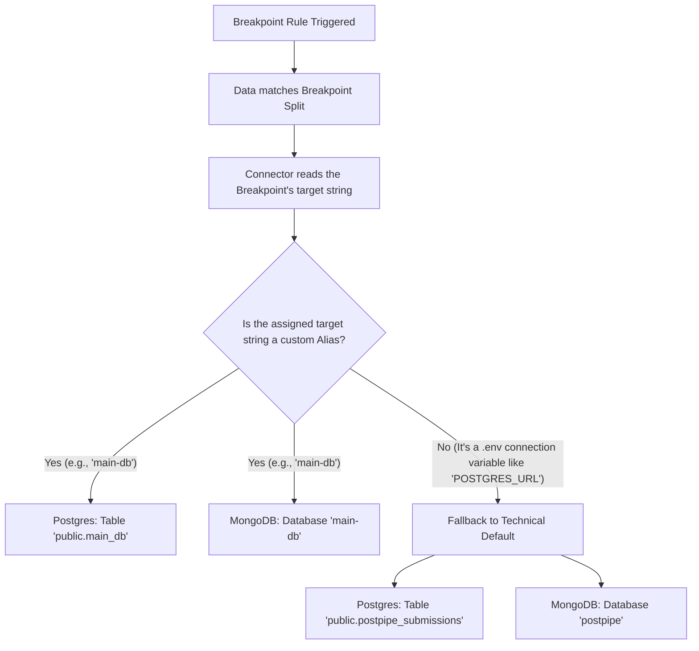

# PostPipe Connector

This is a self-hosted connector for [PostPipe](https://postpipe.in).
It acts as a secure bridge between PostPipe's Ingest API and your private database.

## 🚨 Security Principles

1.  **Zero Trust**: This connector never trusts the payload blindly. It verifies the request signature `X-PostPipe-Signature` using your `POSTPIPE_CONNECTOR_SECRET`.
2.  **No Leaks**: Database credentials exist ONLY in this environment. PostPipe never sees them.
3.  **Audit**: All security logic is in `src/lib/security.ts`. You are encouraged to read it.

## 🚀 Getting Started

### 1. Installation

```bash
npm install
```

### 2. Configuration

Copy `.env.example` to `.env` and fill in your details:

```env
POSTPIPE_CONNECTOR_ID=pp_conn_...
POSTPIPE_CONNECTOR_SECRET=...     # Keep this secret!
DB_TYPE=mongodb                   # mongodb | postgres | supabase
```

### 3. Run Locally

```bash
npm run dev
```

The server will listen on port 3000.
Endpoint: `POST http://localhost:3000/postpipe/ingest`

## 📦 Deployment

### Docker

```bash
docker build -t my-connector .
docker run -p 3000:3000 --env-file .env my-connector
```

### Vercel / Serverless

This project is set up as a standard Express app. To deploy to Vercel, simply add a `vercel.json`:

```json
{
  "version": 2,
  "builds": [{ "src": "src/server.ts", "use": "@vercel/node" }],
  "routes": [{ "src": "/(.*)", "dest": "src/server.ts" }]
}
```

## 🛠 Troubleshooting

- **Invalid Signature**: Check that `POSTPIPE_CONNECTOR_SECRET` matches exactly what is in your PostPipe Dashboard.
- **Timestamp Skew**: Ensure your server's clock is synced (NTP). Requests older than 5 minutes are rejected.

## 🌐 Multi-Database Routing

This connector supports routing submissions to different databases based on the Form configuration.

### 🧭 Core Routing Logic

When a payload arrives from PostPipe, the connector inspects the `targetDatabase` alias. This alias determines where the data goes.



#### 1. Primary Form Routing (`targetDatabase`)

When a form has an explicit **Target Database** set in the builder (like `main-db` or `second-db`), the connector actively prioritizes that exact name.

- **MongoDB:** It connects to the provided connection string and uses the alias as the _database name_. (e.g., connects strictly to the `main-db` database).
- **Postgres:** It connects using the provided connection string and generates a valid SQL table name from the alias. (e.g., `main-db` becomes the `public.main_db` table).

#### 2. Defaulting (No Alias)

If the form has no target custom database set and falls back to the default project connectors (like `MONGODB_URI` or `POSTGRES_URL` environment variables), the system recognizes these are raw connection strings, not human-readable alias labels.

To avoid creating weird databases named "mongodb" or tables named "public.postgres_url", it securely defaults to:

- **MongoDB:** The `postpipe` database.
- **Postgres:** The `public.postpipe_submissions` table.

---

### 🔀 Advanced Breakpoint Routing

When a form uses Advanced Breakpoints (Conditional Logic) to split data to secondary databases based on submission values, the connector handles the routed data independently of the main form target.



Because Breakpoints are configured dynamically in the builder, they can either securely target a named Database Alias (like `main-db`) or fall back directly to the base environment variables (`POSTGRES_URL`).

If a Breakpoint routes strictly to the base variable without a named alias, the connector recognizes this and guarantees the data lands seamlessly in your primary default database/tables (`postpipe` and `public.postpipe_submissions`).

---

### 🛠 Naming Conventions

The connector is designed to guarantee SQL compatibility in Postgres. You can safely name your databases with hyphens or spaces in the builder UI without breaking the connector.

| Custom Builder Alias       | MongoDB Database Name | Postgres Table Name           |
| :------------------------- | :-------------------- | :---------------------------- |
| `main-db`                  | `main-db`             | `public.main_db`              |
| `marketing forms`          | `marketing forms`     | `public.marketing_forms`      |
| `second-db`                | `second-db`           | `public.second_db`            |
| _(None /_ `MONGODB_URI`)\* | `postpipe`            | `public.postpipe_submissions` |

---

### Basic Settings in Web App

In the **Form Builder**, use the **Target Database** feature:

1.  Click **[+ Add DB]**.
2.  Enter an ID (e.g., `marketing`).
3.  Select this ID for your form.

### 2. Configure Connector Environment

The connector dynamically looks for an environment variable matching the ID:

```env
# Default DB
MONGODB_URI=mongodb+srv://...

# Secondary DB (ID: "marketing")
MONGODB_URI_MARKETING=mongodb+srv://...

# Another DB (ID: "finance")
MONGODB_URI_FINANCE=mongodb+srv://...
```

**Note**: The connector automatically maps the ID to uppercase and prepends `MONGODB_URI_`.

### 3. Data Fetching

You can fetch submissions directly from the connector (bypassing PostPipe cloud) using the local API:

**Endpoint**: `GET /api/postpipe/forms/:formId/submissions`

**Parameters**:

- `limit` (optional): Number of records (default 50).

**CORS**: Enabled by default for all origins.
